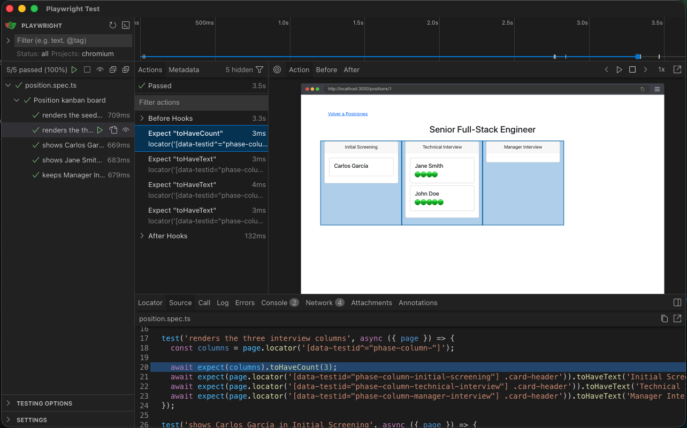
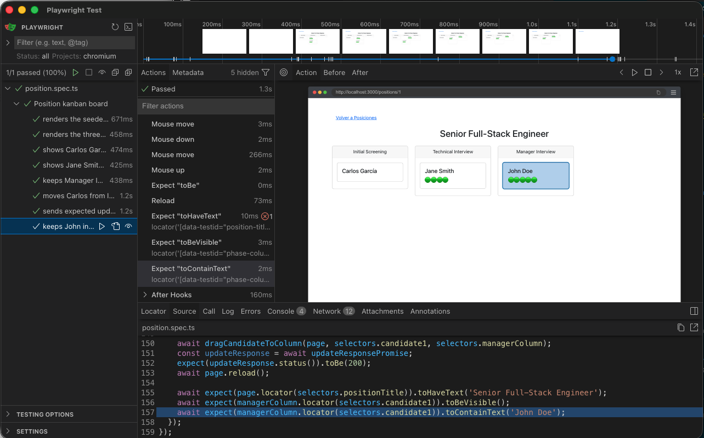

# Prompts utilizados - ACE - Alberto Contreras

## 1. Preparación del prompt para actualizar la documentación

/meta-prompt
As an senior architect expert on developing apps using React and Node, we want to update the documentation included in the `/docs` folder with the current status of the project.

Review the documentation and check that all the content is still relevant. Update it only if you find diferences between the current status and the documented file. Keep the structure of the files.

### Resultado

You are a senior software architect with expertise in React and Node.js projects.

Your objective is to review and update the documentation inside the `/docs` folder so it accurately reflects the current state of the project.

Instructions:
1. Inspect the current project structure, implementation, and relevant configuration files only as needed to verify whether each documentation file is still accurate.
2. Review every file in `/docs` and compare its content against the current project status.
3. Update a documentation file only when you find a real mismatch, omission, or obsolete statement.
4. Preserve the existing structure, sections, and organization of each documentation file.
5. Do not rewrite content that is already correct.
6. Do not add new documentation files unless strictly necessary to reflect existing documented scope.
7. Keep all updates precise, factual, and consistent with the current codebase.

Output requirements:
- For each documentation file reviewed, state whether:
  - no changes were needed, or
  - updates were made
- If updates are made, apply only the minimum necessary changes to make the documentation accurate.
- Do not include speculative improvements, stylistic rewrites, or unrelated refactoring of the documentation.

## 2. Actualización de la documentación

You are a senior software architect with expertise in React and Node.js projects.

Your objective is to review and update the documentation inside the `/docs` folder so it accurately reflects the current state of the project.

Instructions:
1. Inspect the current project structure, implementation, and relevant configuration files only as needed to verify whether each documentation file is still accurate.
2. Review every file in `/docs` and compare its content against the current project status.
3. Update a documentation file only when you find a real mismatch, omission, or obsolete statement.
4. Preserve the existing structure, sections, and organization of each documentation file.
5. Do not rewrite content that is already correct.
6. Do not add new documentation files unless strictly necessary to reflect existing documented scope.
7. Keep all updates precise, factual, and consistent with the current codebase.

Output requirements:
- For each documentation file reviewed, state whether:
  - no changes were needed, or
  - updates were made
- If updates are made, apply only the minimum necessary changes to make the documentation accurate.
- Do not include speculative improvements, stylistic rewrites, or unrelated refactoring of the documentation.

### Resultado

Reviewed the full docs set and updated only the files that had factual drift from the current codebase.

Updated:
- docs/backend/api-documentation.md: corrected the positions endpoints, added `GET /positions`, fixed response shapes for candidate and position-related endpoints, and removed the malformed summary entry.
- docs/frontend/project-overview.md: removed the nonexistent `App.tsx`, added the active `/positions/:id` route, and aligned the overview and folder structure with the actual app.
- docs/frontend/conventions.md: corrected the JS/TS file mix and current TypeScript usage.
- docs/frontend/component-catalog.md: replaced outdated component descriptions with the current API-backed positions flow, documented the actual PositionDetails.js implementation, and added the currently used supporting components.
- docs/frontend/patterns.md: updated the architectural notes to reflect direct `fetch` usage across screens and the drag-and-drop board pattern.
- docs/frontend/services.md: aligned the service-layer doc with the current reality that the UI bypasses the service module, noted the missing position service, and documented the `axios`/manifest mismatch.
- docs/frontend/dependencies.md: updated dependencies to match package.json, added the actual DnD and Playwright packages, and documented the missing `jest.config.js` and undeclared `axios`.
- docs/frontend/styling.md: removed the stale `App.tsx` reference and aligned the styling notes with the active components.
- docs/testing/end-to-end-testing-guidelines.md: updated commands to the actual frontend location and noted that e2e is configured but currently empty.

No changes needed:
- docs/documentation-guidelines.md

Validation: markdown/workspace diagnostics for all updated docs returned no errors.

Natural next steps:
1. If you want, I can now fix the code/documentation mismatches the review exposed, starting with the missing frontend `axios` dependency or the undocumented `POST /candidates/:id/interviews` UI flow.
2. I can also turn these documentation updates into a short review note for your prompts file in propmpts/prompts-ACE.md.

Made changes.

## 3. Actualización del seed de la base de datos para regenerar los datos antes de cada test

/enrich-us 01-update-seed.md

### Resultado

He aplicado el prompt con el argumento solicitado y he creado el ticket refinado en:

- 01-update-seed.md

Qué incluye:
1. Sección H2 [original] con el contenido original intacto.
2. Sección H2 [enhanced] con una User Story enriquecida y lista para implementación autónoma.
3. Corrección del contexto técnico real: el seed está en backend, no en frontend.
4. Alcance funcional detallado, modelos/campos afectados, impacto en endpoints (sin cambios), archivos a modificar, criterios de aceptación, Definition of Done, pruebas recomendadas y requisitos no funcionales (seguridad, rendimiento, fiabilidad y mantenibilidad).

Made changes.

### Ejecución de la tarea

Implement the following ticket

#### 01 - Update seed

##### User Story

As a QA engineer,
I want the database seed process to be idempotent,
so that I can regenerate a clean dataset before every E2E run without manual cleanup or duplicate-key failures.

##### Context

Current behavior in `backend/prisma/seed.ts` inserts records with `create` operations only. Re-running the script against a non-empty database causes unique constraint errors (for example, `Candidate.email`, `Company.name`, `Employee.email`) and leaves test setup unstable.

The original ticket references `frontend/prisma/seed.ts`, but the real seed file is `backend/prisma/seed.ts`.

##### Functional Scope

Implement a reset-and-seed strategy in the backend seed script:

1. Before inserting fixture data, remove existing data from seeded tables in a safe order (or using a transaction) that respects foreign-key constraints.
2. Recreate the full baseline dataset currently expected by frontend flows and E2E scenarios.
3. Ensure the script can run repeatedly with the same final result and without errors.

##### Data/Fields Affected

The seed touches these models and their key constrained fields:

- `Candidate`: `email` (unique)
- `Company`: `name` (unique)
- `Employee`: `email` (unique)
- `Education`: FK `candidateId`
- `WorkExperience`: FK `candidateId`
- `Resume`: FK `candidateId`
- `Position`: FK `companyId`, FK `interviewFlowId`
- `InterviewFlow`
- `InterviewType`
- `InterviewStep`: FK `interviewFlowId`, FK `interviewTypeId`
- `Application`: FK `positionId`, FK `candidateId`, FK `currentInterviewStep`
- `Interview`: FK `applicationId`, FK `interviewStepId`, FK `employeeId`

##### API and Endpoint Impact

No REST API contract changes are required for this ticket.

- Changed endpoints: none
- New endpoints: none
- Deprecated endpoints: none

##### Technical Implementation Details

###### Files to Modify

- `backend/prisma/seed.ts`
- `backend/package.json` (optional but recommended, add script aliases for repeatable execution)
- `README.md` or testing docs (optional but recommended to document the canonical command)

###### Expected Seed Flow

1. Initialize Prisma client.
2. Cleanup phase:
   - Delete dependent tables first (`Interview`, `Application`, `Resume`, `WorkExperience`, `Education`, `InterviewStep`, `Position`, `Employee`) and then parent tables (`InterviewType`, `InterviewFlow`, `Candidate`, `Company`),
   - or use a database-safe strategy (single transaction and explicit order).
3. Insert baseline fixtures in deterministic order.
4. Disconnect Prisma client in `finally`.

###### Command

Canonical command remains:

```bash
cd backend
npx ts-node ./prisma/seed.ts
```

Recommended npm script aliases:

```json
{
  "scripts": {
    "db:seed": "ts-node ./prisma/seed.ts",
    "db:seed:reset": "ts-node ./prisma/seed.ts"
  }
}
```

##### Acceptance Criteria

1. Running `npx ts-node ./prisma/seed.ts` once succeeds with exit code 0.
2. Running it a second time (without manual DB cleanup) also succeeds with exit code 0.
3. After each run, expected baseline records exist for positions, interview flows/steps, candidates, applications, and interviews.
4. No duplicate record errors are thrown on unique fields.
5. Seeded data remains consistent across runs (same business fixtures available for tests).

##### Definition of Done

1. Seed script is idempotent and repeatable.
2. Developer/QA can reset test data with a single command.
3. Command usage is documented in project docs or npm scripts.
4. Existing backend tests keep passing.
5. No regressions in E2E preconditions related to seeded data.

##### Testing Requirements

###### Minimum validation

1. Execute seed script twice in a row.
2. Verify no runtime error on second execution.
3. Verify key entities are present after second run.

###### Recommended automated checks

- Add a lightweight integration test or script check that executes seed twice against a test database.
- Ensure this check can be run in CI for stability.

##### Non-Functional Requirements

- Safety: avoid accidental use against production-like databases (recommended guard via environment check, e.g. allow only local/test DB names).
- Performance: cleanup + seed should complete in reasonable local time for E2E preparation.
- Reliability: script must always close Prisma connection (`finally`).
- Maintainability: clear cleanup order and comments only where relation ordering is non-obvious.

##### Out of Scope

- Changes to frontend behavior.
- API redesign.
- Migration/schema redesign unrelated to seed idempotency.

#### Resultado

Implemented the ticket with code changes and runtime validation.

Changes made
1. Idempotent reset-and-seed flow in seed.ts
2. Safe cleanup order wrapped in a transaction in seed.ts
3. Original fixture creation moved into a dedicated seed function in seed.ts
4. Main execution now runs cleanup then reseed, with clear logs and guaranteed disconnect in seed.ts
5. Added npm script aliases for repeatable seeding in package.json

What this now guarantees
1. Running the seed once succeeds.
2. Running it again without manual cleanup also succeeds.
3. Unique-field collisions are avoided because dependent and parent tables are cleared before inserts.
4. Baseline fixture set is recreated deterministically each run.

Validation performed
1. Ran seed twice in a row:
- First run: success
- Second run: success

2. Verified post-seed baseline counts after second run:
- positions: 2
- interviewFlows: 2
- interviewSteps: 3
- candidates: 3
- applications: 4
- interviews: 3

Notes on tests
1. I also ran backend Jest tests.
2. The suite is currently failing due pre-existing issues outside this ticket scope (including tests under dist and an existing expectation mismatch in position service tests).
3. The seed implementation itself executed correctly and repeatedly with stable data.

If you want, I can take the next step and clean up the backend test command so it only runs source tests and does not include dist artifacts.

Made changes.

### Correción adicional

There is one small issue when running the seed more than one, it is not keeping the ids of the records on each table, so when running the tests there failures because of that. Could you please enforce the ids on each record we create using the seed?

#### Resultado

Done. I enforced fixed IDs across the full seed and validated it works on repeated runs.

What changed
1. Added explicit id values for every seeded record, including nested related records and interviews:
- seed.ts
- Examples:
  - Company/flows/positions: seed.ts
  - Candidates + nested Education/WorkExperience/Resume IDs: seed.ts
  - Interview types/steps/employees/applications/interviews: seed.ts

2. Added sequence synchronization after seeding so future inserts without explicit IDs remain safe:
- seed.ts
- Called from main flow: seed.ts

Validation run
1. Seed executed twice successfully in a row (no errors).
2. IDs after second run are stable and deterministic:
- company: [1]
- interviewFlow: [1, 2]
- position: [1, 2]
- candidate: [1, 2, 3]
- education: [1, 2, 3]
- workExperience: [1, 2, 3]
- resume: [1, 2, 3]
- interviewType: [1, 2, 3]
- interviewStep: [1, 2, 3]
- employee: [1, 2]
- application: [1, 2, 3, 4]
- interview: [1, 2, 3]

3. Sequence health check passed:
- Creating one extra candidate after seed produced nextCandidateId=4 (then removed).

Made changes.

## Creación del test e2e de carga de la pantalla de una posición

/enrich-us 02-loading-a-position.md

### Resultado

Created 02-loading-a-position.md with the required [original] and [enhanced] sections.

The enhanced ticket now makes the story autonomous by fixing the seeded dataset, the exact board selectors, the backend endpoints the page depends on, the intended test scope, and the single Playwright spec to add at frontend/tests/e2e/position.spec.ts.

Validation passed for the new markdown file with no errors found.

Made changes.

### Implementación del test

Implement the following ticket:

#### 02 - E2E test for "Loading a position kanban board"

##### User Story

As a QA engineer,
I want an automated Playwright test for the position kanban board at `/positions/:id`,
so that we can verify the board loads correctly against the seeded dataset after every UI change.

##### Context

The position details screen is implemented in `frontend/src/components/PositionDetails.js`. It loads the board by calling the backend endpoints:

- `GET /positions/:id/interviewflow`
- `GET /positions/:id/candidates`

The test must run against the deterministic dataset produced by `backend/prisma/seed.ts`.

For this story, the seeded database must contain:

- Position `id=1` with title `Senior Full-Stack Engineer`
- Three interview steps for that position:
  - Initial Screening
  - Technical Interview
  - Manager Interview
- Three candidates assigned to position `id=1`:
  - `Carlos García` with `id=3` in `Initial Screening`
  - `Jane Smith` with `id=2` in `Technical Interview`
  - `John Doe` with `id=1` in `Technical Interview`
- No candidates in `Manager Interview`

##### Functional Scope

Create one end-to-end spec that verifies the page renders the kanban board correctly when a recruiter opens `/positions/1`.

The test should validate only loading and rendering behavior. It does not need to test drag-and-drop or stage updates.

##### Selectors and Assertions

Use the existing stable test IDs already present in the UI:

- `data-testid="position-title"`
- `data-testid="phase-column-initial-screening"`
- `data-testid="phase-column-technical-interview"`
- `data-testid="phase-column-manager-interview"`
- `data-testid="candidate-card-1"`
- `data-testid="candidate-card-2"`
- `data-testid="candidate-card-3"`

Assert both structure and content:

1. The page title renders `Senior Full-Stack Engineer`.
2. Exactly three interview columns are visible.
3. The column headers match the seeded interview step names.
4. `Initial Screening` contains only Carlos García.
5. `Technical Interview` contains Jane Smith and John Doe in that order.
6. `Manager Interview` is empty.

##### Files to Modify

- `frontend/tests/e2e/position.spec.ts`

No application code changes are expected for this ticket because the route, API calls, and `data-testid` hooks already exist.

##### Test Data and Environment Requirements

Before running the spec, the database must be seeded with:

```bash
cd backend
npx ts-node ./prisma/seed.ts
```

Then run the Playwright test from the frontend app:

```bash
cd frontend
npx playwright test tests/e2e/position.spec.ts
```

##### Acceptance Criteria

1. The new spec file exists at `frontend/tests/e2e/position.spec.ts`.
2. The spec contains one or more test cases with clear, descriptive names.
3. The test covers the page title, the three interview columns, and the candidate distribution across the board.
4. The test passes using the seeded dataset without manual UI interaction.
5. The test is stable and uses the existing `data-testid` selectors instead of brittle text-only locators.

##### Definition of Done

1. The E2E coverage for `/positions/:id` exists and is repeatable.
2. The test can be run independently with Playwright.
3. The story is documented with the expected seeded state and exact selectors.
4. No backend or frontend runtime behavior is changed by this task.

##### Non-Functional Requirements

- Determinism: the test must rely on the fixed seeded IDs and data names only.
- Maintainability: keep locators stable and aligned with existing `data-testid` attributes.
- Reliability: avoid assertions that depend on timing beyond the normal page load.
- Scope control: do not expand the test to cover drag-and-drop or unrelated screens.

##### Out of Scope

- Modifying the board UI.
- Changing API contracts.
- Testing drag-and-drop interactions.
- Adding new selector attributes to production code.

#### Resultado

The file diagnostics are clean now. I’m repeating the Playwright discovery check once so we know the spec still parses after the locator cleanup.

Ran terminal command:  npx playwright test tests/e2e/position.spec.ts --list
Completed with input:  npx playwright test tests/e2e/position.spec.ts --list

Implemented the E2E spec in position.spec.ts. It covers the title, the three interview columns, Carlos García in `Initial Screening`, the two candidates in `Technical Interview`, and an empty `Manager Interview`, using the existing `data-testid` hooks.

Validation passed with `npx playwright test tests/e2e/position.spec.ts --list`, and the file-level diagnostics are clean. If you want, I can next wire Playwright to start the frontend/backend automatically so this spec can run without manual server startup.

Made changes.

#### Verificación de los tests



## Creación del test e2e de drag and drop

/enrich-us 03-stage-change.md

### Resultado

He aplicado el enriquecimiento solicitado para 03-stage-change.md siguiendo el prompt, y ya está creado en:

- 03-stage-change.md

Qué incluye:
1. Sección H2 [original] con el ticket base conservado.
2. Sección H2 [enhanced] con una User Story lista para ejecución autónoma.
3. Validación de que la historia original no estaba completamente detallada.
4. Contrato técnico completo: endpoints reales, payload esperado, campos actualizados en backend y estrategia de aislamiento entre tests.
5. Casos de prueba concretos para drag and drop, verificación de request y persistencia tras recarga.
6. Criterios de aceptación, Definition of Done, NFRs y alcance fuera de scope.

Verificación:
- Sin errores de diagnóstico en 03-stage-change.md.

Made changes.

### Implementación de ticket

Implement the following ticket:

#### 03 - E2E test for "Changing candidate stage in kanban board"

##### User Story

As a QA engineer,
I want automated Playwright coverage for drag-and-drop stage changes in `/positions/:id`,
so that we can validate UI behavior and backend persistence after board interactions.

##### Context

The kanban board is implemented in `frontend/src/components/PositionDetails.js` with `react-beautiful-dnd`.

Current runtime flow:
- Board metadata: `GET /positions/:id/interviewFlow`
- Board candidates: `GET /positions/:id/candidates`
- Stage update on drop: `PUT /candidates/:candidateId`

The frontend sends this payload in the PUT request:

```json
{
  "applicationId": 4,
  "currentInterviewStep": 3
}
```

Persistence target in backend:
- Model/table: `Application`
- Updated field: `currentInterviewStep`

##### Seeded Data Contract (must exist before test execution)

Use:

```bash
cd backend
npx ts-node ./prisma/seed.ts
```

Expected deterministic records for position `id=1`:
- Title: `Senior Full-Stack Engineer`
- Steps:
  - `Initial Screening` (stepId: `1`)
  - `Technical Interview` (stepId: `2`)
  - `Manager Interview` (stepId: `3`)
- Candidates in board:
  - `candidateId=3` Carlos Garcia, `applicationId=4`, current step `1`
  - `candidateId=2` Jane Smith, `applicationId=3`, current step `2`
  - `candidateId=1` John Doe, `applicationId=1`, current step `2`

##### Functional Scope

Implement drag-and-drop E2E tests in the existing spec file to verify:
1. Candidate card moves from source column to destination column in UI after drop.
2. Correct backend request is sent (`PUT /candidates/:id`).
3. Change persists after page reload.
4. Existing board-loading tests remain in the file and continue passing.

##### Selectors to Use (stable, mandatory)

- `data-testid="position-title"`
- `data-testid="phase-column-initial-screening"`
- `data-testid="phase-column-technical-interview"`
- `data-testid="phase-column-manager-interview"`
- `data-testid="candidate-card-1"`
- `data-testid="candidate-card-2"`
- `data-testid="candidate-card-3"`

Avoid brittle text-only locators for card placement assertions.

##### Endpoints and Payloads

###### Read endpoints
- `GET http://localhost:3010/positions/1/interviewFlow`
- `GET http://localhost:3010/positions/1/candidates`

###### Write endpoint
- `PUT http://localhost:3010/candidates/:candidateId`

Required request-body fields:
- `applicationId` (number)
- `currentInterviewStep` (number)

##### Test Cases to Implement

###### Case 1: Move Carlos from Initial Screening to Manager Interview
Given recruiter opens `/positions/1`
When candidate `candidate-card-3` is dragged from `phase-column-initial-screening` to `phase-column-manager-interview`
Then `phase-column-initial-screening` has 0 candidate cards
And `phase-column-manager-interview` contains `candidate-card-3`

###### Case 2: Validate update request contract during drag-and-drop
Given recruiter opens `/positions/1`
When `candidate-card-2` is dragged from Technical to Manager
Then one request `PUT /candidates/2` is emitted
And JSON body equals:

```json
{
  "applicationId": 3,
  "currentInterviewStep": 3
}
```

###### Case 3: Persistence after reload
Given recruiter opens `/positions/1`
When `candidate-card-1` is dragged from Technical to Manager
And recruiter reloads page
Then `phase-column-manager-interview` contains `candidate-card-1`
And that card includes candidate name `John Doe`

##### Test Isolation Strategy (mandatory)

To keep each test independent and repeatable, implement one of these strategies:
1. Preferred: reset board state in `afterEach` by sending PUT calls to restore seeded steps:
   - `candidate 1 -> step 2` with `applicationId=1`
   - `candidate 2 -> step 2` with `applicationId=3`
   - `candidate 3 -> step 1` with `applicationId=4`
2. Alternative: reseed database before each test (heavier runtime).

The chosen strategy must guarantee no test depends on order or leftovers from previous tests.

##### Files to Modify

- `frontend/tests/e2e/position.spec.ts`

No production runtime code changes are required for this ticket.

##### Execution Commands

```bash
cd backend
npx ts-node ./prisma/seed.ts
```

```bash
cd frontend
npx playwright test tests/e2e/position.spec.ts
```

##### Acceptance Criteria

1. `frontend/tests/e2e/position.spec.ts` includes existing board-loading tests plus new stage-change tests.
2. Stage-change tests validate UI movement, request contract, and persistence after reload.
3. Tests use the existing `data-testid` selectors for columns and cards.
4. Tests are deterministic and isolated (state reset or reseed strategy implemented).
5. The spec passes consistently against the seeded dataset without manual DB cleanup between test cases.

##### Definition of Done

1. Drag-and-drop behavior for `/positions/1` is covered by automated E2E tests.
2. Backend update request contract is asserted in at least one test.
3. Persistence after reload is covered.
4. Existing position-board E2E coverage remains valid.
5. The test suite can run from command line with documented commands.

##### Non-Functional Requirements

- Reliability: no flaky assertions based on arbitrary waits; rely on explicit locator assertions and/or request waits.
- Maintainability: clear test names and reusable helpers for drag operation and board reset.
- Performance: keep runtime reasonable; avoid full reseed per test unless required.
- Security: tests must only target local/test environments (`localhost:3000` frontend and `localhost:3010` backend).

##### Documentation Impact

No mandatory documentation file update is required if execution commands remain unchanged.
If command or setup conventions are modified, update `docs/testing/end-to-end-testing-guidelines.md` accordingly.

##### Out of Scope

- Modifying kanban UI components.
- Changing backend API contracts.
- Adding new production `data-testid` attributes.
- Covering unrelated candidate detail workflows.

#### Resultado

Implemented ticket 03 by updating the existing Playwright spec with drag-and-drop stage-change coverage, request contract checks, persistence verification, and deterministic test isolation.

Changes made:
1. Added reusable selector map and helper utilities in position.spec.ts.
2. Added a robust drag helper using mouse-based interaction over the droppable card body, which works with react-beautiful-dnd in this app: position.spec.ts.
3. Added mandatory isolation via afterEach reset calls to backend PUT endpoints:
position.spec.ts
4. Kept all existing board-loading tests intact.
5. Added the 3 new stage-change tests required by the ticket:
- UI movement (Carlos to Manager): position.spec.ts
- Request contract assertion for Jane move (PUT /candidates/2 with expected JSON body): position.spec.ts
- Persistence after reload for John move: position.spec.ts

Validation performed:
1. Seeded deterministic backend data with local backend script:
npm --prefix /Users/alconesp/Development/ai4devs/AI4Devs-qa-202602-Seniors/backend run db:seed
2. Ran Playwright spec:
npm --prefix /Users/alconesp/Development/ai4devs/AI4Devs-qa-202602-Seniors/frontend exec playwright test tests/e2e/position.spec.ts --reporter=line
3. Result: 8 passed, 0 failed.

If you want, I can now also split these tests into two describe blocks (loading vs stage-change) to make future maintenance and CI triage faster.

Made changes.

#### Verificación de los tests

